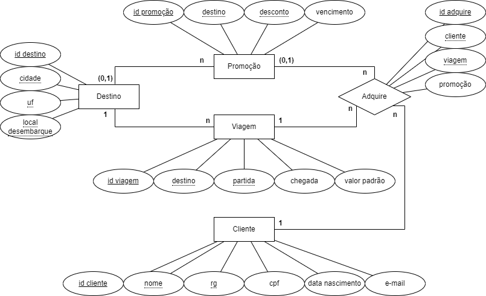

# Projeto Agência de Viagens - Recode Pro 2021
## BlueBird Viagens
### Desenvolvedor: Vítor Mateus Santos Parreiras

Desenvolvimento de um site para clientes realizarem cadastro e aquisições de viagens de uma agência fictícia chamada **BlueBird Viagens**.

#### Modelagem Entidade-Relacionamento


#### Instalação

###### 1. Banco de dados
1. Será necessário ter o SQL Server instalado, configurado para login usando o Windows e sem um banco de dados de nome *AgenciaViagens*;
2. Rode o script BancoDeDados/criarBD.sql no SQL Server;
Como se trata de um site voltado aos clientes, será necessário que já existam destinos, promoções e viagens no banco de dados. Para isso:
3. Rode o script popularDestinoBD.sql
4. Rode o script consultaBD.sql;
5. No arquivo popularPromocaoViagemBD.sql, nas inserções nas tabelas Promocao e Viagem, altere os valores correspondentes ao atributo destino com id's aleatórios obtidos na consulta do item 3;
6. Rode o script popularPromocaoViagemBD.sql;

###### 2. String de conexão
1. Edite o arquivo AgenciaViagens/Web.config, na linha 13, inserindo o seu hostname após data source;
```
data source=Aqui_vem_seu_hostname;initial catalog=AgenciaViagens;
```
###### 3. Execução
1. Abra o arquivo AgenciaViagens.sln com o Visual Studio e execute
--------- Fim ---------